<p align="center">
  
</p>

<h1 align="center">NumChess</h1>

<p align="center">
  <b>Chess for the NumWorks N0120 calculator.</b><br>
  12 bots, endless puzzles and a two-player clock, in a native app of about 20 KB.
</p>

<p align="center">
  <a href="https://github.com/Mason363/NumChess/releases/latest"></a>
  <a href="https://github.com/Mason363/NumChess/actions/workflows/build.yml"></a>
  
</p>

<p align="center">
  <a href="https://github.com/Mason363/NumChess/releases/latest/download/chess.nwa"><b>Download chess.nwa</b></a>
  &nbsp;·&nbsp; <a href="#install">Install</a>
  &nbsp;·&nbsp; <a href="#controls">Controls</a>
  &nbsp;·&nbsp; <a href="#build">Build</a>
</p>

<p align="center">
  
</p>

## Highlights

* **12 bots**, from Pip (150) to Atlas (2100), most of them at the beginner end.
* **Endless puzzles** created on the calculator: mate in 1, 2 or 3, or find the one winning move. A rating and a streak track your progress.
* **Two-player mode** with a chess clock. The board turns to face whoever is to move.
* **Fast and small:** about 20 KB installed. The piece set takes 658 bytes, and there's no puzzle database.

<table>
  <tr>
    <td align="center"><br><sub>Main menu</sub></td>
    <td align="center">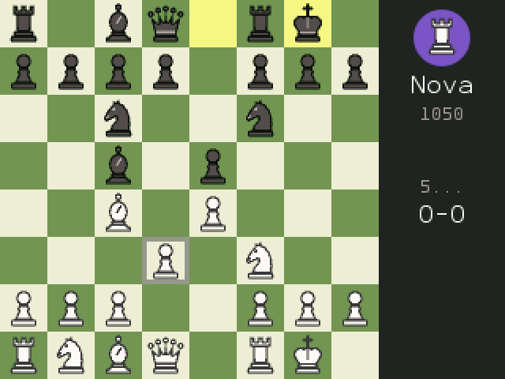<br><sub>A game against Nova</sub></td>
  </tr>
</table>

## Play the bots

Pick an opponent and a color (White, random or Black), then play. Each bot beats the one below it in bot-vs-bot matches. The Elo numbers are rough estimates.

<p align="center">
  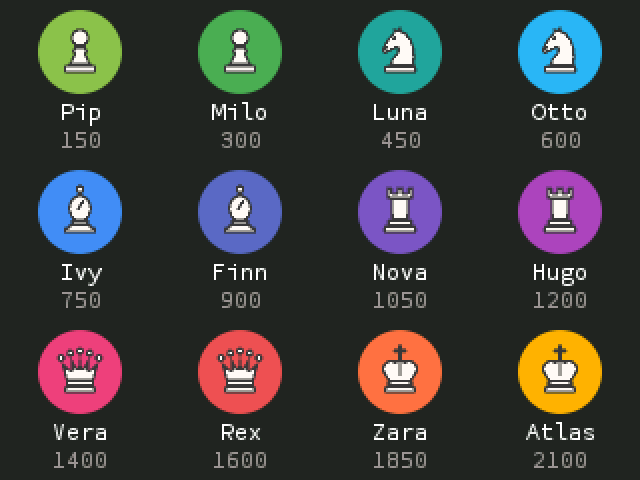
</p>

<table>
  <tr>
    <td align="center"><br><sub>Choose a bot and your color</sub></td>
    <td align="center"><br><sub>Atlas, the strongest bot, thinks up to 2.5 s per move</sub></td>
  </tr>
  <tr>
    <td align="center">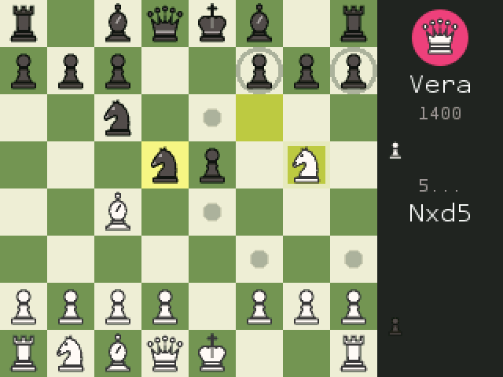<br><sub>Legal moves as dots, captures as rings</sub></td>
    <td align="center">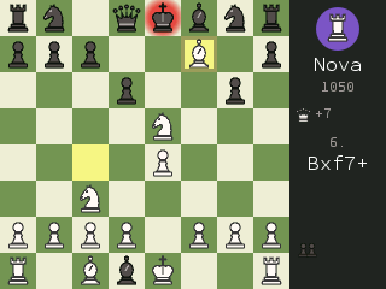<br><sub>Check glow, last-move highlight, captured pieces with material count</sub></td>
  </tr>
  <tr>
    <td align="center">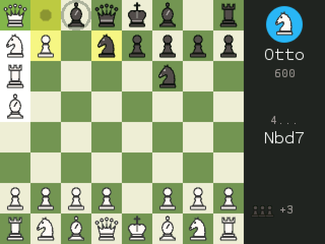<br><sub>Promotion picker</sub></td>
    <td align="center">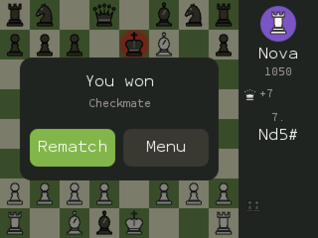<br><sub>Result card with rematch</sub></td>
  </tr>
  <tr>
    <td align="center">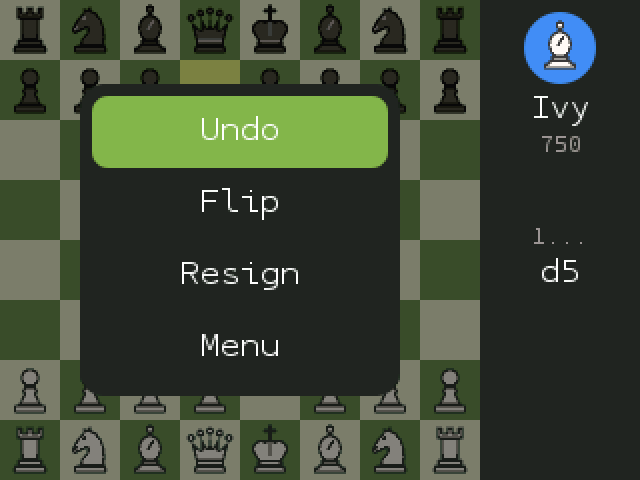<br><sub>Back opens the pause menu: undo, flip, resign</sub></td>
    <td></td>
  </tr>
</table>

## Puzzles

Every puzzle is generated on the calculator. It plays a quick game between a careful side and a blunder-prone side, then stops at a position with a forced mate or a single winning move. Puzzles never run out, and the app stores none of them.

<p align="center">
  
</p>

* **Modes:** Mix, Mate in 1, Mate in 2, Mate in 3 and Best move.
* **Opening move:** each puzzle starts by playing the opponent's last move, which is the mistake you punish.
* **Accepted solutions:** any move that still forces the mate counts. The opponent defends as stubbornly as possible.
* **Rating:** it goes up or down after each puzzle, and Mix and Best move pick puzzles near it. A streak counts your solves in a row.
* **Pause menu:** Hint highlights the piece to move, Solution plays the answer, and Next skips.
* **Speed:** the next puzzle is prepared while you look at the solved one.

<table>
  <tr>
    <td align="center">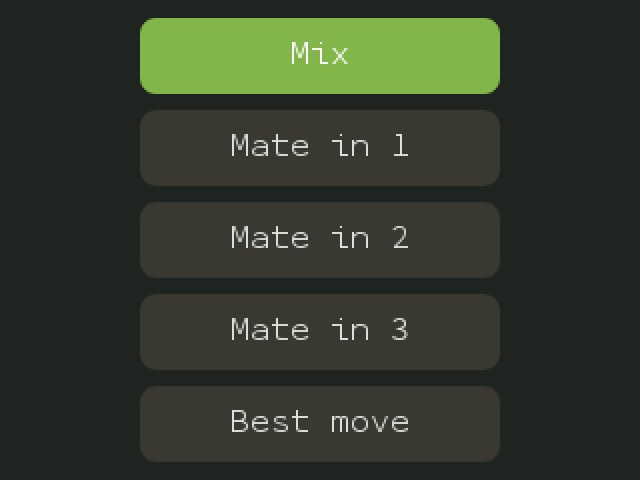<br><sub>Puzzle modes</sub></td>
    <td align="center">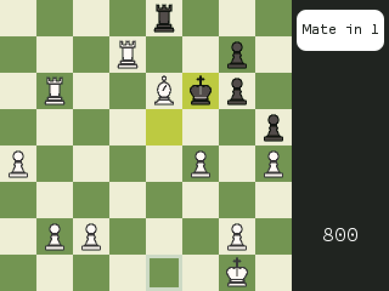<br><sub>Mate in 1: the pill shows who is to move</sub></td>
  </tr>
  <tr>
    <td align="center">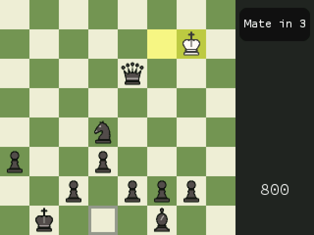<br><sub>Mate in 3 as Black: the board flips for you</sub></td>
    <td align="center">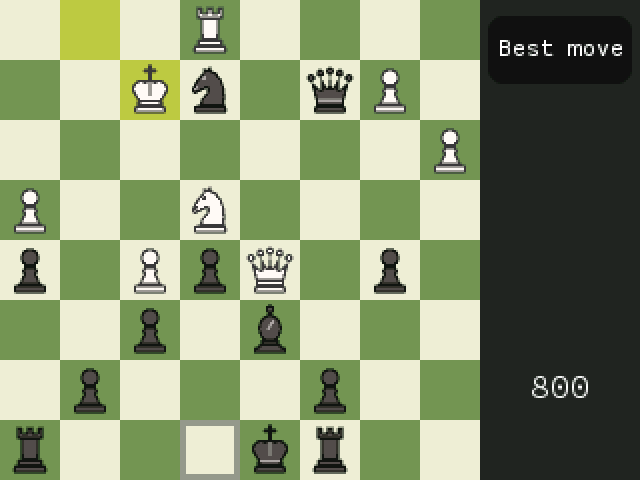<br><sub>Best move: find the knight fork</sub></td>
  </tr>
  <tr>
    <td align="center">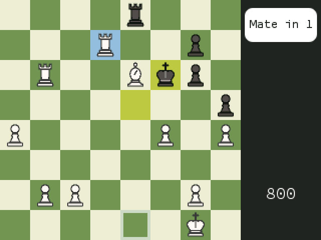<br><sub>Hint</sub></td>
    <td align="center">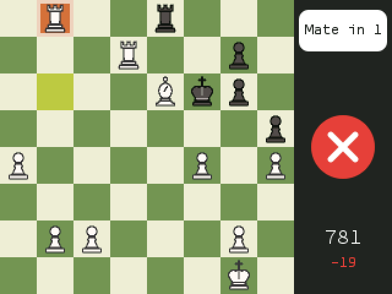<br><sub>Wrong move: it's taken back and your rating drops</sub></td>
  </tr>
  <tr>
    <td align="center">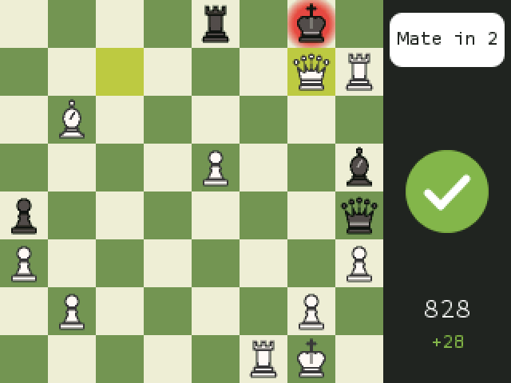<br><sub>Solved</sub></td>
    <td align="center">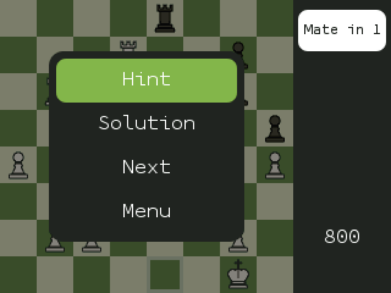<br><sub>Hint, solution, next</sub></td>
  </tr>
</table>

## Two players

Play over the board with a chess clock. After every move the board turns to face the next player. If you prefer a fixed board, use Flip in the pause menu.

<p align="center">
  
</p>

<table>
  <tr>
    <td align="center">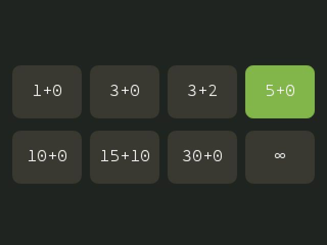<br><sub>1+0 to 30+0, or no clock</sub></td>
    <td align="center"><br><sub>The active clock is lit</sub></td>
    <td align="center">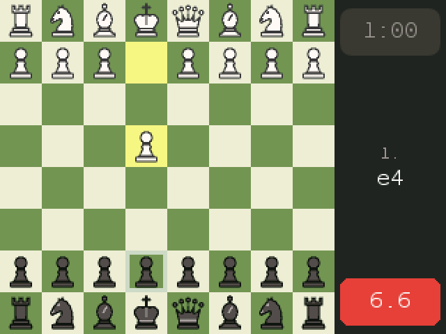<br><sub>Under 10 s it turns red and shows tenths</sub></td>
  </tr>
</table>

All the rules are included: castling, en passant, underpromotion, and draws by stalemate, threefold repetition, the 50-move rule or insufficient material. You can also agree to a draw or resign.

## Controls

| Key | Action |
|---|---|
| Arrows | Move the cursor (it wraps around the edges) |
| OK or EXE | Select a piece, then play a move |
| Back | Deselect, open the pause menu, or go back a screen |
| ⌫ | Undo |
| Home | Quit |

## Install

1. Download **[chess.nwa](https://github.com/Mason363/NumChess/releases/latest/download/chess.nwa)** from the [latest release](https://github.com/Mason363/NumChess/releases/latest).
2. Plug the calculator into your computer and open **[my.numworks.com/apps](https://my.numworks.com/apps)** in Chrome or Edge.
3. Upload `chess.nwa`. **Chess** appears at the end of the calculator's home screen.

If you're building from source, `make run` builds and installs in one step.

## Small by design

<p align="center">
  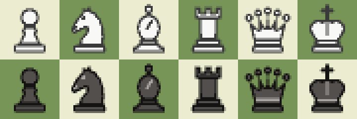
</p>

| | |
|---|---|
| Installed size | about 20 KB (20,074 bytes of code and data) |
| Piece set | 658 bytes: 3-bit anti-aliased sprites, and symmetric pieces store only half |
| Puzzle data | none: every puzzle is generated live |
| RAM | about 52 KB, all static, no heap |

* **Engine** (`src/chess.c`):
  * 0x88 board with incremental hashing and evaluation.
  * PeSTO piece-square tables, mirrored and packed into 384 bytes.
  * Alpha-beta search with PVS, a transposition table, null-move pruning, late-move reductions, killer moves and history heuristics.
  * A mate solver.
  * Bots get weaker through search depth, evaluation noise and occasional random moves.
* **Graphics** (`src/main.c`):
  * Each board square is drawn in one pass: highlights, check glow, move hints and the piece, all blended in RGB565.
  * Rounded cards and circles are anti-aliased.
  * Moves animate with an ease-out curve.
  * Text uses the calculator's own fonts.
* **Pieces** are drawn as signed-distance shapes by `tools/pieces.py` and rendered to sprites. `tools/icon.py` makes the app icon the same way.
* **Build:** `-Os`, LTO, and small replacements for the libc routines.

## Build

Requirements: the ARM embedded toolchain (`arm-none-eabi-gcc`) and Node.js, which `make` uses to fetch NumWorks' `nwlink` SDK.

```sh
make          # output/chess.nwa
make check    # link it the way the calculator does and print the installed size
make test     # engine tests on the host: perft on six positions, hashing, search benchmark
make run      # install on a connected calculator
```

Every push is built by GitHub Actions. Pushing a `v*` tag publishes a release with `chess.nwa` attached.
