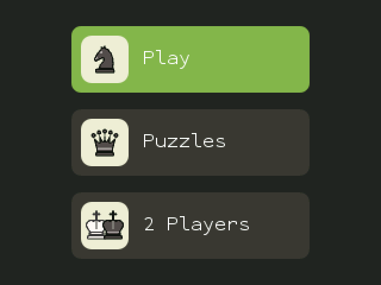
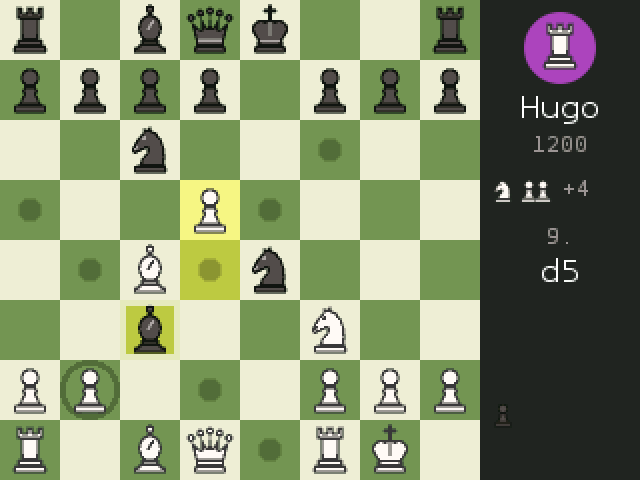
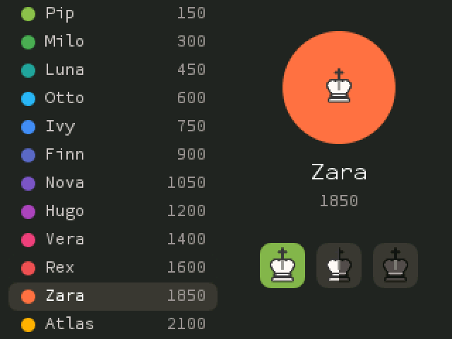
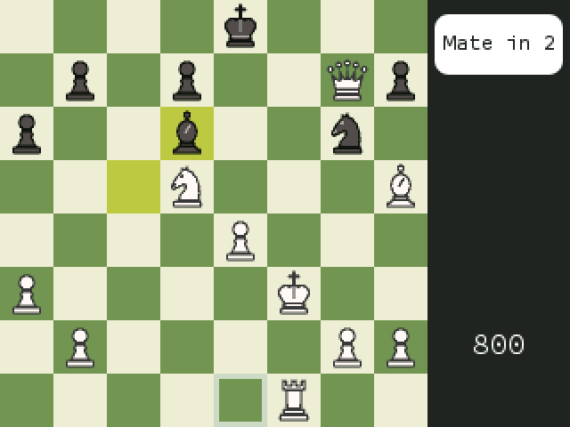
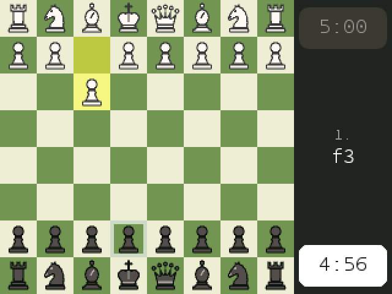

# NumChess

Chess for the NumWorks calculator, built for the **N0120**. It's a native app of about 19 KB: bots, endless puzzles and a two-player clock.

<p>
  
  
  
  
  
</p>

## Features

**Play** against 12 bots, most of them at the beginner end:

| Bot | Elo | | Bot | Elo |
|---|---|---|---|---|
| Pip | 150 | | Nova | 1050 |
| Milo | 300 | | Hugo | 1200 |
| Luna | 450 | | Vera | 1400 |
| Otto | 600 | | Rex | 1600 |
| Ivy | 750 | | Zara | 1850 |
| Finn | 900 | | Atlas | 2100 |

You can play White, Black, or a random color. Bot-vs-bot matches confirm that each bot beats the one below it. The Elo numbers themselves are rough estimates.

**Puzzles** never run out: each one is generated on the calculator from a fresh game, so no puzzle database is stored.

* Modes: *Mix*, *Mate in 1*, *Mate in 2*, *Mate in 3* and *Best move* (win material with the only good move, sometimes several moves deep).
* A rating adapts to your results and picks puzzles near your level, and a streak counts your solves in a row.
* The opponent defends as stubbornly as possible, and any move that forces the mate counts as correct.
* The pause menu offers *Hint* and *Solution*.

**2 Players** over the board, with a chess clock (1+0, 3+0, 3+2, 5+0, 10+0, 15+10, 30+0 or no clock). The board turns to face whoever is to move.

**Everywhere:**

* Legal-move dots and capture rings.
* Last-move and check highlights.
* Animated moves.
* A promotion picker.
* Captured pieces with the material difference.
* Undo, flip, resign and draw.
* Every draw rule: stalemate, threefold repetition, 50 moves and insufficient material.

## Controls

| Key | Action |
|---|---|
| Arrows | Move the cursor (wraps around the edges) |
| OK / EXE | Select a piece, play a move |
| Back | Deselect, or open the pause menu |
| ⌫ | Undo |

## Install

1. Get `chess.nwa`: download it from the latest [Build](../../actions) run, or build it yourself (see below).
2. Open [my.numworks.com/apps](https://my.numworks.com/apps), connect the calculator and upload the file.

Or run `make run` with the calculator plugged in.

## Build

Requirements: the ARM embedded toolchain (`arm-none-eabi-gcc`) and Node.js, which `make` uses to fetch NumWorks' `nwlink` SDK.

```sh
make          # output/chess.nwa
make check    # link it the way the calculator does and print the installed size
make test     # engine tests on the host (perft on six positions, hashing, search benchmark)
```

## How it stays small

* **Engine** (`src/chess.c`):
  * 0x88 board with incremental hashing and evaluation.
  * PeSTO piece-square tables, mirrored and packed into 384 bytes.
  * Alpha-beta search with PVS, a transposition table, null-move pruning, LMR, killer moves and history heuristics.
  * A mate solver.
  * Bots get weaker through search depth, evaluation noise and occasional random moves.
* **Puzzles** are found by playing lopsided games between a careful side and a blunder-prone side, then keeping positions that have a forced mate or a single winning move.
* **Pieces** are signed-distance shapes rendered by `tools/pieces.py` to 3-bit anti-aliased sprites. The symmetric pieces store only their left half, so the whole set takes 658 bytes.
* **Text** uses the calculator's built-in fonts, and small replacements stand in for the libc routines.
* The app is built with `-Os` and LTO and uses no heap.
